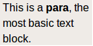
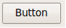
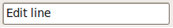
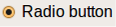
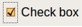
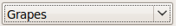
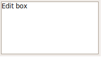
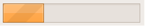
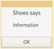

# Shoes Cheatsheet

## App

```ruby
Shoes.app do
  ...
end
```

## Layout

```ruby
# vertikal
stack do
  ...
end

 
# horizontal
flow do
  ...
end
```

## Layout dynamisch manipulieren

```ruby
slot = stack

slot.append { para 'Huhu' }
slot.prepend { para 'Zuerst' }

 
slot.clear { para 'Nur dieser Text' }
```

## Komponenten

### Text



```ruby
banner 'Riesig'
title 'Gross'
subtitle 'Kleinerer Titel'
tagline 'Für Wichtigeres'
caption 'Beschreibungen'
para 'Hallo Welt'
inscription 'Klein'
```

### Button



```ruby
button 'Klick mich' do

  append { para "Ok!" }
end
```

### Eingabefeld



```ruby
input = edit_line
button 'Mach was' do
  append { para input.text }
end
```

### Radio Button



```ruby
movie = :tea

radio(:movies).click { movie = :tea }; para "The Taste of Tea\n"
radio(:movies).click { movie = :kin }; para "Kin-Dza-Dza\n"

button 'Ok' do
  append { para movie }
end
```

### Check Box



```ruby
tea = check; para "The Taste of Tea\n"

button 'Ok' do
  if tea.checked?
    append { para 'The Taste of Tea' }
  else
    append { para 'None' }
  end
end
```

### List Box



```ruby
fruits = list_box items: ['Grapes', 'Pears']
button 'Ok' do
  append { para fruits.text }
end
```

### Edit Box



```ruby
input = edit_box
button 'Mach was' do
  append { para input.text }
end
```

### Progress



```ruby
p = progress
animate do |i|
  p.fraction = (i % 100) / 100.0
end
```

### Bilder

```ruby
image 'https://placekitten.com/640/360'
```

## Dialoge

### Information



```ruby
alert 'Information'
```

### Frage mit Eingabefeld


```ruby
response = ask 'Welcher Film?'
append { para response }
```

### Bestätigung


```ruby
response = confirm 'Loeschen?'
if response
  append { para 'Geloescht!' }
end
```

## Shoes Console öffnen

- Windows/Linux: `Alt + /`
- macOS: `⌘ + /`
